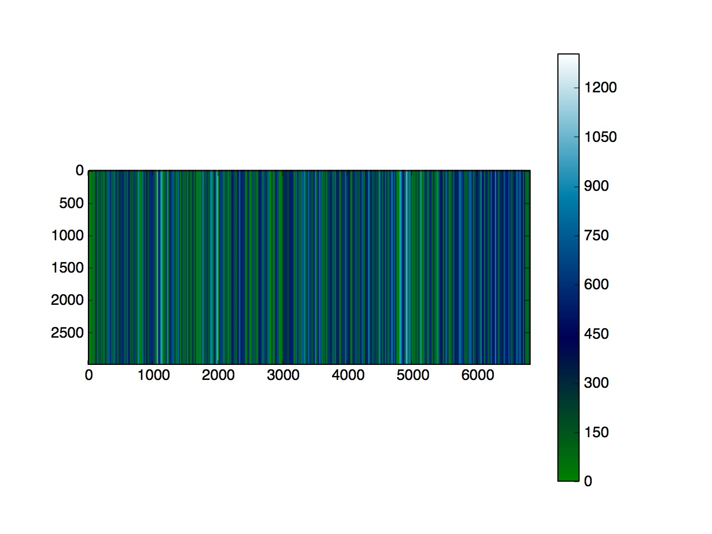
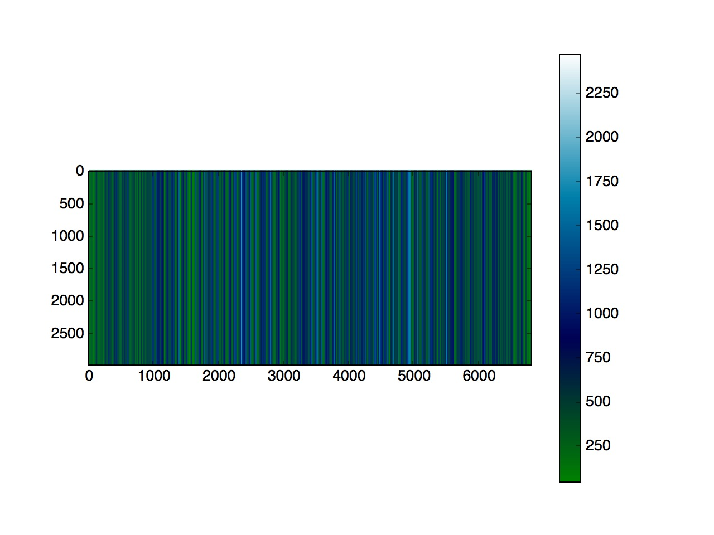
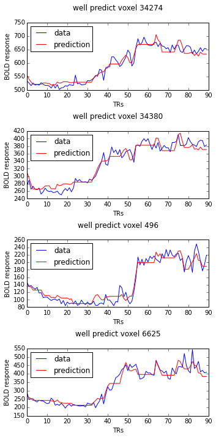

% Project Beta Progress Report
% Yuan Wang (Aria), Cindy Mo, Yucheng Dong (Steve), Rishi Sinha, Raj Agrawal
% December 3, 2015

# Generate 3 brain masks

- Thresholded on voxel variance, three brain masks are generated that gives us 3087, 6810, 34589 voxels, respectively.

# All attempts
- Scenes analysis: k-means clustering
- Description/words analysis: Ridge Regression, Neural Network

# Scenes Analysis: Basic Approach
 - Created different factor groups (e.g. Gump house, military, Savanna etc) to test if there was a 
 - connection between these groups and a subject’s brain activity
 - Filtered the data to include only 6800 voxels (with the highest signal)
 - Subsetted the times to only include times that corresponded to a factor id of interest
 - Kmeans clustering

# Scenes Analysis: Some Things We Found:
 - The Gump house and military scenes appeared to have a very strong response in the subject
 - we studied
 - When running kmeans  (with two clusters) on times that corresponded to the factors ‘Gump 
 - house’ and ‘Military,’ we got 88% accuracy 
 - We did this on many other combinations of factor categories. When looking at larger groups, 
 - one thing that stood out was that factor categories that seemed related did relatively poorly in 
 - the clustering. For example, when we tried to cluster the factors ‘military’ and ‘political’ (along
 - with other factors) separately, the clustering labels often mismatched between these two 
 - categories. However, when we re-ran kmeans with these two categories combined, our 
 - overall accuracy went up by 15%. 

# Scenes Analysis:

# Scenes Analysis:

#Ridge Regression
- A voxel-vise ridge regression model is built to model all the words as features on the masked voxels. 
- 2,3,4 s of time lags are added to the feature matrix to aligh with the BOLD response
- 1200 TRs are used as training set and 90 TRs are used as test set. I did a 10-fold cross validation to test on 10 differnt ridge parameters. 

#Ridge Regression - design matrix

# Ridge Regression - correlations coefficients

# Ridge Regression - prediction

# Neural Network

## Set up
# Neural Network: Initialization
- Single layer perceptron
- Input: timepoint with voxel activity as features
- Output: prediction of presence of common words in scene

